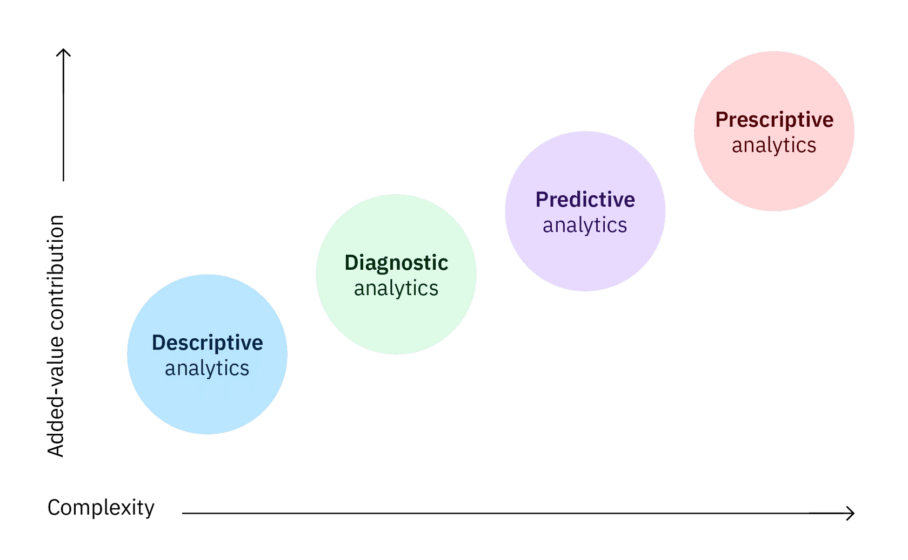

# Data

Data is raw information. It might be facts, statistics, opinions, or any content that can be recorded in some format. It is organized into one of two forms: structured or unstructured data

Structured data is information that can be organized in rows and columns like Excel, databases. Unstructured data has no predefined format or organization in its structure. It's a conglomeration of varied types of data that are stored in thier original form. For example, images, texts, social media posts, customer reviews, etc,.

Unstructured data can be harder to work with compared to structured data. Yet unstructured data reveals what people don't know - the unknowns. Insights are often obtain by analyzing unstrucuted data. For instance, if a software company gets a lot of emails about its products, the text data is unstructured, by looking deep or examinig the contents, a data analysts can figure out the vital information.

A key concept to know is that most data falls into one of two groups:

- qualitative
- quantitative

Quantitative data relates to number thus it is also called numerical data. It can be counted, or measured. While qualitative data relates to words and descriptions. It is also called categorical data since it represents the characteristics, attibutes, properties, and qualities of entities. Rather than using number, is uses a language.

Qualitative data can further be split into two categories which are:

- nominal
- ordinal

Also, quantitative data can be split to:

- discrete
- continuous

## Databases

A database is an organized collection of structured data in a computer system or manual file system. Most databases are computerized so it is almost as if it can only exist on a computer yet you can still have a database of papers. To get data from a database, you query it.

Most databases are organized as relational databases - arranged in a tabular format.

## Big Data

The basic idea behind the phrase "Big Data" is that everything we do is increasingly leaving a digital trace which we can use and analyze. Big data demainds innovative, cost-effective forms of information processing the enable enhanced insight, decision making and process automation.

The elements of big data can be explained using five broad characteristics called 5V's. They help data scientists make sense of what they are working with. The 5V's are:

- Volume,
- Variety,
- Velocity,
- Veracity, and
- Value

### Volume

Volume refers to the vast amounts of data being generated usually in exabytes, zettabytes, or yottabytes. The volume increase as more and more of the Earth's population adopt the digital age specifications.

### Variety

Variety refers to the different types of data to use. From structure, to unstructured data.

### Velocity

This refers to the incredible speed at which new data is generated and the spped at which it moves around. Data is constantly being generated and moved around extremely fast!

### Veracity

This refers to the quality and trustworthiness of data. You must consider the origin of data to make sure it is complete, has integrity, and is traceable.

## Value

Value is the ability to turn data into value. Primarily, the main reason why people and companies invest time and money to understand big data is to derive value from it. Whether is it saving lives, reducing costs, ensuring product availability, it has value.

## Types of data analytics

The Information Technology industry typically recognizes four types of data analytics

- Descriptive analytics
- Diagnostic analytics
- Predictive analytics
- Prescriptive analytics

Each type has a different goal and a different place in the data analysis process, and answers to a specific question.
Each one of these types is connected and relies on one another's output to a certain degree. Moving from descriptive to predictive and prescriptive requires much more technical ability but also unlocks more insights to the organization.

As depicted by the image above, the level of difficulty and resource required increases for each type of data analytics. At the same time, the level of added insight and value also increases.

### Descriptive analytics

This is the simplese and most common one. It answers the question "What is happening?" It provides a snapshot of business trends and pattenrs and uses historical and current data. It manipuates raw data from multiple sources to give valuable insights into the past and a view
of key metrics within a business. These finding do not necesarily specify the "Why" part. However, the findings can help determine what the biggest issues are and we can start investigating from there.

### Diagnostic analytics

After you know what is happening, having gotten the insights form descriptive analytics, the next step is to dive deeper and ask why. Diagnostic analytics takes the insights found from descriptive analytics and drills down to find the cause of specific problems. For example, a frieght company investigates the cause of slow shipments in a certain region.

### Predictive analytics

This kind is more about forecasting. It uses historical data to make predictions about the future. Whether it's the likelihood of an event, forecasting a quantifiable amount, or estimating a point at which something might happen.
This is much more important when a use case is under uncertainty.

### Prescriptive analytics

The final one is prescriptive analytics which combines all the insights from previous analyses to determing a course of action to take to address a problem or make a decision. Mainly, the purpose of this one is to prescribe what action to take to eliminate a future problem or take full advantage of an opportunity. 
Prescriptive analytics uses advanced tools and technologies, like machine learning, business rules, and algorithms. This make it sophisticate to implement and manage.

## Data Analytics process

Data analysis is the process of collecting, cleaning, and tranforming data to obtain insights to help make better and informed decisions. Before embarking on a data analysis project, a company must clear define a problem it has to solve which inherently gives the types of questions to ask. Also,
determing the metrics to measure performance.

- Collect:
This step is all about collecting the right data and just enough data for the project's questions or problems we want to research. First determint the data you can use from any existing sources and databases. Next you need to figure out if you need new resources to ensure that you have enough data.
- Clean:
Data cleaning is the process of detecting and correcting missing and/or inaccureate records from the dataset. Ensure that the data is in a usable format. This involves search for outliers, dealing with null values, and looking for incorrect input. Use data wrangling to ensuer its in a usable format. Search for duplicate records and remove then if any.
Do keep in mind that your cleaning procedure needs to be based on the underlying context and this means that in once case you may choose to input missing values using the mean and in some you might just be required to drop them entirely. Data cleaning usually consumes much of the time.
- Analyze:
Use various statistical and analytical methods or tools to analyze the data. Problem solving and curiosity bears the optimal results.
- Visualize:
You need to intepret the results of analysis in a graphically and visually appealing manner. Data visuals help in comparing datasets and observing relationships.

## Extract, transform, and load (ETL)

ETL is a data integration process that combines data from multiple data sources into a single, consistent data store that is loaded into a data warehouse or lake or iceberg. It provides the foundation for data analytics and machine learning workstreams and it is often used to:

- Extract data from legacy sytems
- Cleanse the data to improve data quality and establish consistency
- Load into a targer data warehouse or source

## Data Visualization

A data visualization is a graphical display of abstract comples information and they are primarily used for two reasons which are:

- To explore and interpret data during analysis to identify patterns or trends
- To communicate results and help people understand the insights to make decisions

The goal is to have a visual that's effective, attrictive, and impactive.
Data storytelling is the process of converting data analyses into a simple, understandable story to influence a business decision. The idea is to "connect the dots" between the results and the decison makers, who must be able to interpret the data. It involes a combination of data visualization, and narrative.

- When a narrative is coupled with data, it explain to the audience what is happening in the data and why an insight is important
- when visualizations are applied to data, they enlighten the audience with insights that they might not obtain without charts or graphs. Patterns and trends emerge from all the rows and columns in a database, with the help of data visualizations.
- When a narrative and visualizations come together, they can create a data story that can influence, drive change, and engage audience.

### Types of visualizations

Charts convey different meanings so it is important to select the best one to use in your visualization.